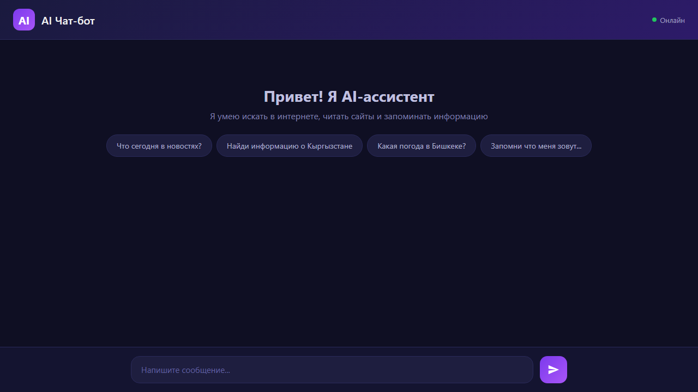

# AI Чат-бот

Умный веб-чат-бот с доступом к интернету, чтением сайтов и долговременной памятью. Красивый тёмный интерфейс, бэкенд на Flask, AI на базе Google Gemini 3.6 Flash.




## Возможности

### Саморазвитие через интернет
- **Поиск в интернете** — бот сам ищет актуальную информацию через DuckDuckGo (новости, факты, данные)
- **Чтение веб-страниц** — заходит на любой URL и извлекает текст для анализа
- **Долговременная память** — сохраняет важные факты в `memory.json`, помнит информацию между сессиями
- **Автоматический выбор инструментов** — AI сам решает, когда искать, читать сайт или запоминать

### Интерфейс
- Общение с AI на любом языке
- Тёмный интерфейс в стиле ChatGPT
- История диалога в рамках сессии
- Кнопки-подсказки для быстрого старта
- Анимация набора текста
- Адаптивный дизайн (мобильные устройства)
- Отправка по Enter, новая строка по Shift+Enter

### Примеры запросов

| Запрос | Что сделает бот |
|---|---|
| «Что сегодня в новостях?» | Поищет в интернете актуальные новости |
| «Прочитай эту статью: https://...» | Зайдёт на сайт и перескажет содержимое |
| «Запомни, что меня зовут Алексей» | Сохранит в память, будет помнить в следующих сессиях |
| «Что ты обо мне помнишь?» | Покажет всё, что сохранено в памяти |

## Установка и запуск

### 1. Клонировать репозиторий

```bash
git clone https://github.com/NBA1121-ai/ai-chatbot.git
cd ai-chatbot
```

### 2. Установить зависимости

```bash
pip install -r requirements.txt
```

### 3. Получить API-ключ (бесплатно)

Перейдите на [aistudio.google.com/apikey](https://aistudio.google.com/apikey) и создайте ключ.

### 4. Установить ключ

```bash
export GEMINI_API_KEY="ваш-ключ"
```

### 5. Запустить сервер

```bash
python server.py
```

### 6. Открыть в браузере

```
http://localhost:5000
```

## Структура проекта

```
ai-chatbot/
├── index.html         # Фронтенд (HTML/CSS/JS)
├── server.py          # Бэкенд (Flask + Google Gemini + инструменты)
├── memory.json        # Долговременная память бота (создаётся автоматически)
├── requirements.txt   # Зависимости
└── README.md
```

## Технологии

- **Фронтенд:** HTML, CSS, JavaScript
- **Бэкенд:** Python, Flask
- **AI:** Google Gemini 3.6 Flash (бесплатный API)
- **Поиск:** DuckDuckGo (без API-ключа)
- **Скрапинг:** BeautifulSoup4 + Requests
- **Память:** JSON-файл (локальное хранение)
